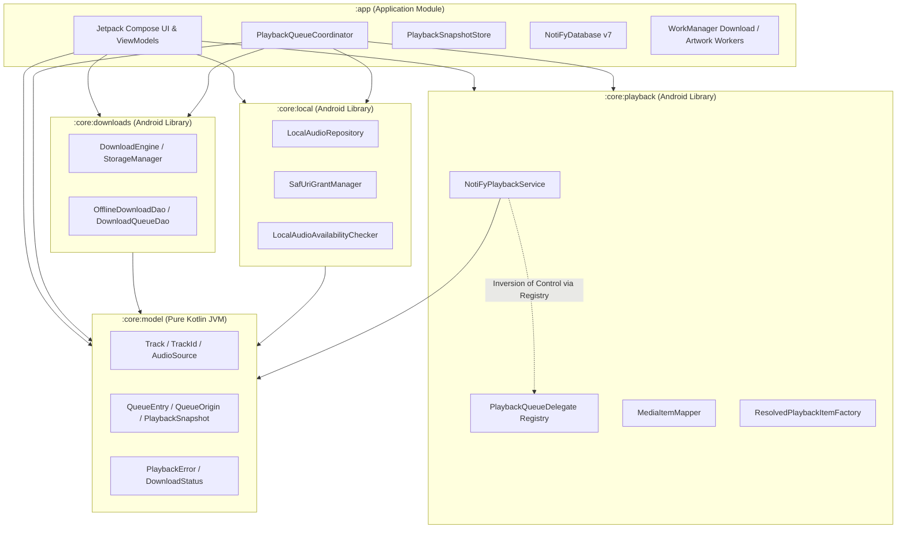
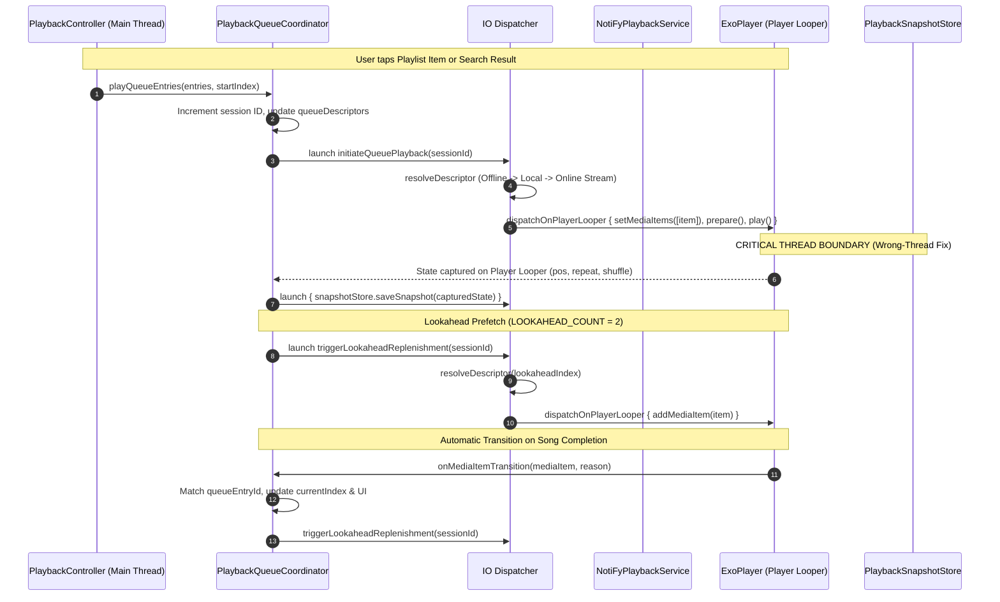
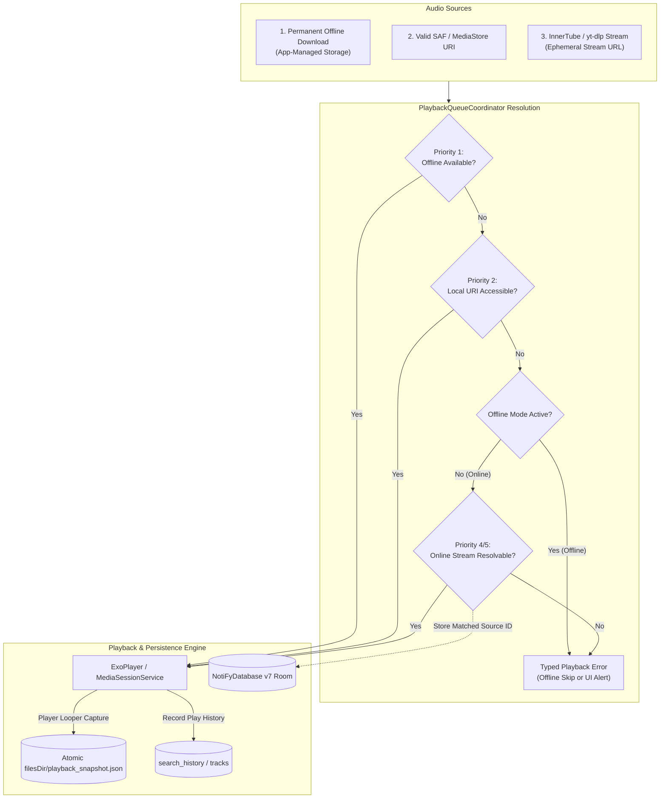

# As-Built Architecture & Dependency Specification

## 1. System Overview & Build Identifiers

- **Application ID**: `com.notify`
- **Current Version**: `versionCode = 14`, `versionName = "0.5.0"` (configured in [app/build.gradle.kts](file:///c:/NotiFy/app/build.gradle.kts#L16-L17))
- **Room Database Schema**: `version = 7` (configured in [NotiFyDatabase.kt](file:///c:/NotiFy/app/src/main/java/com/notify/download/db/NotiFyDatabase.kt#L26))
- **Source Control Status**: Direct workspace inspection confirms **no Git repository** exists in `c:\NotiFy`. No fictitious commit hashes or remotes are referenced.
- **Physical Device Status**: `adb devices -l` indicates no active physical device is currently attached over USB/TCP. Automated unit tests are executed and reported separately from physical device verifications.

---

## 2. Module Hierarchy & Dependency Boundaries

The project is structured into 5 Gradle modules with strict unidirectional dependency boundaries:

### Dependency Invariants:
1. `core:model`: Pure Kotlin JVM, strictly zero Android or Media3 dependencies.
2. `core:playback`: Depends strictly on `:core:model` and AndroidX Media3 (`exoplayer`, `session`, `common`). It has **zero** dependencies on `:core:local`, Room, or `:app`.
3. `core:local`: Depends strictly on `:core:model` and Android framework for SAF / MediaStore cursor reading.
4. `core:downloads`: Depends strictly on `:core:model`, Room, WorkManager, OkHttp, and yt-dlp.
5. Inversion of control: `NotiFyPlaybackService` in `:core:playback` does not reference `PlaybackQueueCoordinator` in `:app`. Instead, `PlaybackQueueDelegateRegistry` in `:core:playback` accepts a factory registered by `NotiFyApplication` in `:app`.

---

## 3. Playback Architecture & Threading Model

---

## 4. Complete Data Flow Diagram

