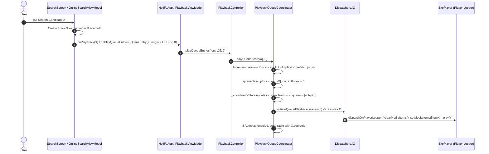

# Detailed Playback & Control Call Chains

This document details the exact execution paths, components, threads, and metadata origins for all 7 playback scenarios in NotiFy.

---

## 1. Playlist Playback Flow

```mermaid
sequenceDiagram
    autonumber
    actor User
    participant Screen as PlaylistDetailScreen
    participant VM as PlaylistDetailViewModel
    participant App as NotiFyApp / PlaybackViewModel
    participant Controller as PlaybackController
    participant Coord as PlaybackQueueCoordinator
    participant IO as Dispatchers.IO
    participant Player as ExoPlayer (Player Looper)
    participant Store as PlaybackSnapshotStore

    User->>Screen: Tap Track at index N (e.g. Track 2)
    Screen->>VM: playPlaylistFromEntry(entry, onPlayQueueEntries)
    VM->>VM: Map playlist to List<QueueEntry>(origin = PLAYLIST)
    VM->>App: onPlayQueueEntries(entries, startIndex = N)
    App->>Controller: playQueueEntries(entries, startIndex)
    Controller->>Coord: playQueue(entries, startIndex)
    Coord->>Coord: Increment session ID, update queueDescriptors, set currentIndex = N
    Coord->>Coord: _coordinatorState.update { currentTrack = entries[N].track }
    Coord->>IO: launch initiateQueuePlayback(sessionId)
    IO->>IO: resolveDescriptor(entry[N]) -> Offline / Local / Stream
    IO->>Player: dispatchOnPlayerLooper { setMediaItems([item]), prepare(), play() }
    Player-->>Coord: State captured on Looper (pos, repeat, shuffle)
    Coord->>IO: launch { snapshotStore.saveSnapshot(...) }
    Coord->>IO: launch triggerLookaheadReplenishment(sessionId)
    IO->>IO: Resolve entries N+1, N+2
    IO->>Player: dispatchOnPlayerLooper { addMediaItem(itemN+1); addMediaItem(itemN+2) }
```

- **Origin of Displayed Metadata**: `PlaybackUiState.currentTrack` is hydrated directly from `QueueEntry.track` for the tapped index. The entire playlist is preserved in `queueDescriptors` so Previous navigates to predecessor tracks (e.g. Track 1).

---

## 2. Search Result Playback Flow (Current Defect vs Repaired State)

### The Proven Defect:
1. `OnlineSearchViewModel.playCandidate(candidate, onPlayStream)` resolved the candidate's audio stream and invoked `onPlayStream(domainTrack, streamUrl)`.
2. `PlaybackController.playStream(track, streamUrl)` called `controller.setMediaItem(mediaItem)` directly on ExoPlayer.
3. **Root Cause**: `PlaybackQueueCoordinator` was **never notified**. Its `queueDescriptors` and `coordState.currentTrack` remained bound to the old playlist (e.g. "Born to Shine" at index 0).
4. When `synchronizeFromController` ran, it executed:
   ```kotlin
   val effectiveTrack = coordState.currentTrack ?: currentTrack
   ```
   Because `coordState.currentTrack` was non-null ("Born to Shine"), the UI displayed "Born to Shine" while the speaker played the search song.
5. When the search song finished, ExoPlayer and the coordinator advanced into descriptor 1 of the **old playlist**.

### Repaired Execution Path:


- **Metadata Origin**: Displayed title, artist, artwork, notification, and next context strictly belong to Track X. Old playlist context is completely evicted.

---

## 3. Manual Next Action

```mermaid
sequenceDiagram
    autonumber
    actor User
    participant UI as Player Controls (Next Button)
    participant Controller as PlaybackController
    participant Coord as PlaybackQueueCoordinator
    participant Player as ExoPlayer (Player Looper)
    participant IO as Dispatchers.IO

    User->>UI: Press Next
    UI->>Controller: skipToNext()
    Controller->>Coord: handleNextAction()
    alt Player has next item in timeline (lookahead hit)
        Coord->>Player: dispatchOnPlayerLooper { seekToNextMediaItem() }
    else Lookahead still resolving or offline skipping needed
        Coord->>UI: _coordinatorState.update { isPreparingNext = true, message = "Preparing next song…" }
        Coord->>IO: launch { findNextPlayableDescriptorIndex(); resolveDescriptor() }
        IO->>Player: dispatchOnPlayerLooper { addMediaItem(item); seekToNextMediaItem(); play() }
        Coord->>UI: _coordinatorState.update { isPreparingNext = false, message = null }
    else Queue exhausted
        alt Autoplay is ON
            Coord->>IO: Fetch related radio recommendations for radioSeedSourceId
        else Autoplay is OFF
            Coord->>UI: Show finished state / stop honestly
        end
    end
```

---

## 4. Natural Track End (Auto-Next)

1. ExoPlayer plays current track to completion (`onMediaItemTransition(mediaItem, reason = MEDIA_ITEM_TRANSITION_REASON_AUTO)`).
2. Because `triggerLookaheadReplenishment` pre-queued up to `LOOKAHEAD_COUNT = 2` contiguous media items in ExoPlayer's timeline, ExoPlayer transitions **gaplessly with zero audio interruption**.
3. `Player.Listener.onMediaItemTransition` fires on `NotiFyPlaybackService` and delegates to `PlaybackQueueCoordinator.onMediaItemTransition`:
   - Extracts `queueEntryId` via `MediaItemMapper.getQueueEntryId(mediaItem)`.
   - Matches `queueEntryId` in `queueDescriptors`.
   - Updates `currentIndex` and `_coordinatorState.update { currentTrack = matchedEntry.track }`.
   - Triggers `triggerLookaheadReplenishment` to maintain 2 lookahead items ahead.
   - Captures player position and writes snapshot.
   - Records track in playback history.

---

## 5. Notification & Remote Controls (Bluetooth / Lockscreen / MediaStyle)

1. User presses Next or Previous on a Bluetooth headset or MediaStyle notification.
2. Media3 `MediaSessionService` receives `COMMAND_SEEK_TO_NEXT_MEDIA_ITEM` or `COMMAND_SEEK_TO_PREVIOUS_MEDIA_ITEM`.
3. `NotiFyPlaybackService`'s `MediaSession.Callback.onPlayerCommandRequest`:
   - For `COMMAND_SEEK_TO_NEXT_MEDIA_ITEM`: delegates to `delegate.handleNextAction()`.
   - For `COMMAND_SEEK_TO_PREVIOUS_MEDIA_ITEM`: delegates to `delegate.handlePreviousAction()`.
4. Remote controls execute the exact same lookahead, offline skipping, and 3-second restart policy as the in-app UI.

---

## 6. Offline Selection & Skipping Flow

1. Device is in airplane mode or network is disconnected (`isNetworkConnected() == false`).
2. In `resolveDescriptor(entry)`:
   - Priority 1: Checks `downloadManager.getOfflinePlaybackUri(trackId)`. If present, creates local file `MediaItem`.
   - Priority 2: Checks `LocalAudioAvailabilityChecker` for content URI. If valid, plays local file.
   - Priority 3: Offline mode active -> strictly aborts online stream resolution (returns `null`).
3. In `initiateQueuePlayback` and `triggerLookaheadReplenishment`:
   - Checks `isEntryAvailableOffline(entry)`.
   - Non-downloaded tracks are skipped in sequence.
   - If all remaining tracks are un-downloaded, displays `"No more downloaded songs available offline."` and stops cleanly without infinite retry loops.

---

## 7. Session Restoration Flow

1. **Cold Start / Force-Stop Recovery**:
   - `NotiFyPlaybackService.onCreate()` calls `restoreSnapshotIfAvailable()`.
   - Loads `filesDir/playback_snapshot.json` on `Dispatchers.IO`.
   - Populates `queueDescriptors`, `currentIndex`, `isAutoplayEnabled`, and `radioSeedSourceId`.
   - State is restored in **paused** mode (never auto-plays on startup).
2. **Live Reconnection**:
   - When Activity re-opens while service is already playing, `PlaybackController.connect()` binds `MediaController`.
   - `synchronizeFromController` reads active player and coordinator state, hydrating UI immediately without restarting or disturbing playback.
